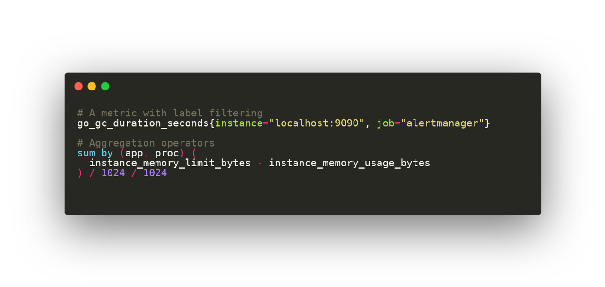

# pygments-promql

A PromQL lexer for [Pygments](https://pygments.org/).

# Installation

## Using `pip`

Run:

```console
pip install pygments-promql
```

## From source code

If you wan to test, play or contribute to this repo:

```console
python setup.py install
```

# Usage

Showing colorized output in a terminal:

```console
pygmentize tests/example.promql
```

Or to generate a PNG file:

```console
pygmentize -f png -O "line_numbers=False" -o tests/example.png tests/example.promql
```


# Testing

```console
pip install -r requirements.txt
pytest tests/ -v
```
